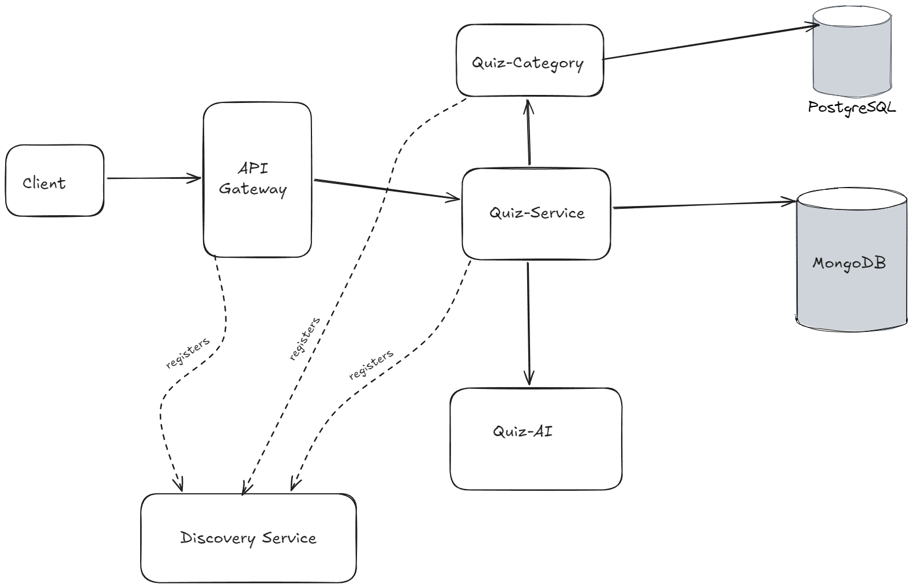

# Smart Quiz Platform (QueryMind)

A distributed, microservices-based quiz platform where users can select a domain and receive dynamically generated quizzes for it. Quiz questions are generated in real time using **Spring AI**, rather than pulled from a static question bank.

> 🚧 **Status:** In Progress — actively being built and extended.

---

## Overview

Smart Quiz Platform lets a user pick a domain (e.g., a subject or topic area) and get a quiz generated specifically for that domain. The system is built as a set of independently deployable microservices that communicate with each other over the network, each owning its own data store.

## Architecture Diagram



## Architecture

- **Microservices Architecture** — the system is split into independent services rather than a single monolith, each responsible for a specific piece of functionality.
- **quiz-service** — communicates with the AI service to auto-generate domain-specific quiz questions.
- **Spring AI integration** — used to generate quiz questions dynamically based on the selected domain.
- **Feign Client** — used for synchronous inter-service (service-to-service) communication.
- **Spring Cloud**
    - **Discovery Service** — service registry so microservices can find and communicate with each other dynamically.
    - **API Gateway** — single entry point that routes incoming requests to the appropriate microservice.
- **Polyglot Persistence** — each microservice uses the database best suited to its data:
    - **MySQL**
    - **PostgreSQL**
    - **MongoDB**
- **Docker Compose** — all microservices are containerized and orchestrated together for one-command local setup and consistent environments.

## Tech Stack

| Category | Technology |
|---|---|
| Backend | Spring Boot |
| Service Discovery / Gateway | Spring Cloud |
| AI / Question Generation | Spring AI |
| Inter-Service Communication | Feign Client |
| Databases | MySQL, PostgreSQL, MongoDB |
| Containerization | Docker, Docker Compose |

## How It Works (High Level)

1. A user selects a domain they want to be quizzed on.
2. The request is routed through the **API Gateway** to the **quiz-service**.
3. **quiz-service** calls the **Spring AI service** (via Feign Client) to generate quiz questions relevant to the selected domain.
4. The generated quiz is returned to the user.
5. Services locate each other dynamically via the **Discovery Service**, and each microservice persists data to its own dedicated database.

## Running Locally

```bash
# Clone the repository
git clone <repo-url>
cd smart-quiz-platform

# Start all services with Docker Compose
docker-compose up --build
```

> Update this section with exact service ports, environment variables, and prerequisites (e.g., API keys for Spring AI) as the project matures.

## Roadmap

- [ ] Finalize domain-to-database mapping across services
- [ ] Add authentication/authorization between services
- [ ] Add persistence/validation for AI-generated quiz content
- [ ] Expand test coverage
- [ ] Deployment setup (CI/CD)

## Status

This project is under active development. Architecture and features described above are being implemented incrementally — this README will be updated as new components are completed.